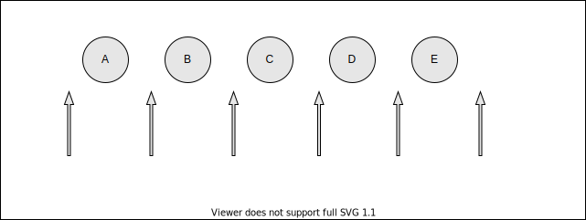

# 正则表达式位置匹配攻略

## 1 什么是位置

- 位置（锚）是相邻字符之间的位置



## 2 如何匹配位置

- 2.1 ^ 和 $

  - `^（脱字符）` 匹配开头位置，在多行匹配中匹配行开头

  - `$` 匹配结尾，在多行匹配中匹配行结尾
  ```js
    const helloRet = 'hello'.replace(/^|$/g, '#')
    console.log(helloRet)      // '#hello#'

    // 多行匹配
    const ret = 'I\nlove\njavascript'.replace(/^|$/gm, '#')
    console.log(ret)
    /*
    #I#
    #love#
    #javascript#
    */
  ```

- 2.2 `\b` 和 `\B`

  - `\b` 是单词边界，具体就是 `\w` 与 `\W` 之间的位置，也包括 `\w` 与 `^` 之间的位置，和 `\w` 与 `$` 之间的位置 
  ```js
    const ret = '[JS] Lesson_01.mp4'.replace(/\b/g, '#')
    console.log(ret)
    // '[#JS#] #Lesson_01#.#mp4#'
    // [ 和 J，S 和 ] 之间都是 \w 与 \W 之间的 位置
    // ] 后面的空格与 L， 1 和 . ， . 和 m 之间都是 \w 和 \W 之间的 位置
    // 4后面是 \w 与 ^ 之间的位置

  ```

  - `\B` 是 `\b` 的反面意思，非单词边界。具体就是 `\w` 与 `\w` 之间，`\W` 与 `\W` 之间，`^` 与 `\W` 之间，`\W` 与 `$` 之间的位置
  ```js
    // 在字符串中所有位置中，扣掉 \b ，剩下的都是 \B 的
    const ret = '[JS] Lesson_01.mp4'.replace(/\B/g, '#')
    console.log(ret)
    // '#[J#S] L#e#s#s#o#n_#0#1.m#p#4'

  ```

- `(?=p) 和 (?!p)`

  - `(?=p)` 是 `p` 的一个子模式，即 `p` 前面的位置，或者说，该位置后面的字符要匹配 `p`
  ```js
    // (?=l) 表示 l 字符前面的位置
    const ret = 'hello'.replace(/?=l/g, '#')
    console.log(ret)       // he#l#lo

    // # 号后面的字符要匹配 l
    // 给 l 的前面位置添加 #

  ```
  - `(?!p)` 就是 `(?=p)` 的反面意思
  ```js
    const ret = 'hello'.replace(/?!l/g, '#')
    console.log(ret)        // #h#ell#o#
    // 匹配 除了 l 前面的位置之外的其他所有位置
    // 除了 l 前面的位置 之外，将其他所有位置替换为 #

  ```

- 2.3 位置的特性

  - **对于位置的理解，我们可以理解成空字符串 `""`**
  ```js
    "hello" = "" + "h" + "" + "e" + "" + "l" + "" + "l" + "" + "o" + ""
    或者
    "hello" = "" + "" + "hello"

    /^hello$/.test('hello')               // true
    /^^hello$$$/.test('hello')            // true

  ```

- 2.4 案例分析

  - 2.4.1 数字千分位表示法
  ```js
    let str = '12345678'        // 12,345,678     把响应的位置替换为 ,
    
    // 弄出最后一个 ,
    let ret = str.replace(/(?=\d{3}$)/g, ',') 
    // (?=\d{3}$) 匹配 \d{3}$ 前面的那个位置，也就是目标最后三位数字前面的位置

    // 逗号出现的位置要求后面3个数字一组，也就是 \d{3}至少出现一次
    ret = str.replace(/(?=(\d{3})+$)/)
    // (\d{3})+ 表示 (\d{3}) 至少出现一次

    // 上述正则在 匹配 3的整数倍的时候会出现给第一个位置也添加 , 
    let str2 = '123456789'
    str2.replace(/(?=(\d{3})+$)/g, ',')        // ',123,456,789'

    // 解决方案：要求匹配到的位置不能是开头的位置
    // 匹配开头使用 ^ ，不是开头 (?!^)
    let regex = /(?!^)(?=(\d{3})+$)/g

    // 如果需要支持其他形式
    // 例如 '12345678 123456789'   =>   '12,345,678 123,456,789'
    // 开头匹配 ^ 和 1 之间， 空格 和 1 之间 ，即 \b。所以不能是 \b ，即 ?!\b ，等价于  \B
    // 结尾是 8 和 空格， 9 和 $ ，即 \b
    // 即 匹配不以 \b 为开头，以 \b 为结尾，每 3 位 数字 前面的位置
    let regex1 = /(\B)(?=(d{3})+\b)/

  ```